# AgentShield SOC

AgentShield SOC is an open-source, evidence-first, evaluation-driven AI Security Operations Center research and portfolio project.

The intended principle is that every AI security verdict should be backed by evidence, counter-evidence, confidence, reasoning metadata, and eventually analyst ground truth. This repository currently contains only the project foundation. Runtime services, detection, AI investigation, and evaluation are not implemented yet.

## Current Status

Day 1 — Repository Foundation

## Intended Architecture

This diagram describes the planned flow. It is not a description of implemented software.

```mermaid
flowchart LR
    SE[Security Event] --> IN[Ingestion]
    IN --> NORM[Normalization]
    NORM --> DET[Detection]
    DET --> COR[Correlation]
    COR --> RISK[Risk Scoring]
    RISK --> CASE[Case]
    CASE --> EV[Evidence]
    EV --> AI[AI Investigation]
    AI --> VER[Verdict Engine]
    VER --> FB[Analyst Feedback]
    FB --> EVAL[Evaluation]
```

